# 附录：RDN 偏振重建与 YOLO 检测核心代码及数据说明

> **适用项目**：藻影知微 — 水下偏振原位智能成像系统
> **用途**：竞赛技术书/项目书附录，提供算法实现的代码级证据
> **最后更新**：2026-08-03

---

## 一、RDN 四通道残差稠密网络

### 1.1 网络结构

RDN（Residual Dense Network）是一个**四通道输入、四通道输出**的偏振重建网络。其生产版本定义在：

> `code/algae_image_v2/core_engine/reconstructor.py` 第 24–92 行

关键架构参数：

| 参数            | 值      | 说明                         |
| --------------- | ------- | ---------------------------- |
| 输入通道        | 4       | I₀, I₄₅, I₉₀, I₁₃₅   |
| 浅层特征        | 4 → 16 | 两层 3×3 卷积               |
| RDB 数量        | 12      | 残差稠密块                   |
| 每 RDB 稠密层数 | 6       | DenseLayer，growth rate = 16 |
| 全局特征融合    | GFF     | 1×1 + 3×3 卷积压缩         |
| 输出通道        | 4       | 重建后的四通道偏振图像       |

核心代码结构（`reconstructor.py:50–92`）：

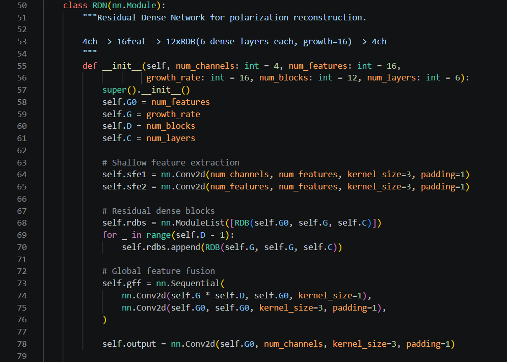

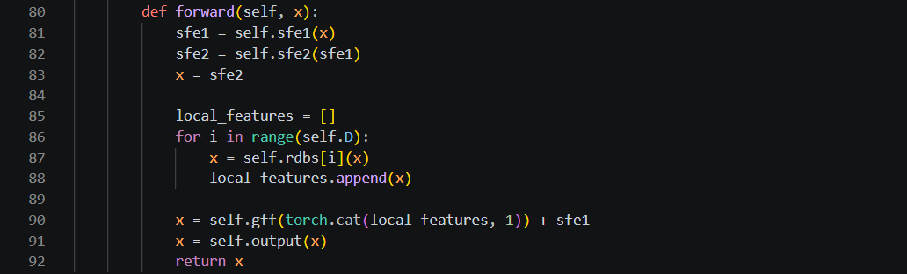

```python
class RDN(nn.Module):
    """Residual Dense Network for polarization reconstruction.
    4ch -> 16feat -> 12xRDB(6 dense layers each, growth=16) -> 4ch
    """
    def __init__(self, num_channels=4, num_features=16,
                 growth_rate=16, num_blocks=12, num_layers=6):
        # 浅层特征提取
        self.sfe1 = nn.Conv2d(num_channels, num_features, 3, padding=1)
        self.sfe2 = nn.Conv2d(num_features, num_features, 3, padding=1)
        # 12 个残差稠密块
        self.rdbs = nn.ModuleList([RDB(self.G0, self.G, self.C)])
        for _ in range(self.D - 1):
            self.rdbs.append(RDB(self.G, self.G, self.C))
        # 全局特征融合 + 输出
        self.gff = nn.Sequential(
            nn.Conv2d(self.G * self.D, self.G0, 1),
            nn.Conv2d(self.G0, self.G0, 3, padding=1),
        )
        self.output = nn.Conv2d(self.G0, num_channels, 3, padding=1)

    def forward(self, x):
        sfe1 = self.sfe1(x)
        sfe2 = self.sfe2(sfe1)
        x = sfe2
        local_features = []
        for i in range(self.D):
            x = self.rdbs[i](x)
            local_features.append(x)
        x = self.gff(torch.cat(local_features, 1)) + sfe1  # 全局残差
        x = self.output(x)
        return x
```

DenseLayer 实现稠密连接（`reconstructor.py:24–32`）：每层将输入与卷积输出在通道维拼接，实现特征复用。

RDB 实现局部残差 + 局部特征融合（`reconstructor.py:35–47`）：`x + self.lff(self.layers(x))`。

### 1.2 推理接口

四通道推理入口（`reconstructor.py:149`）：

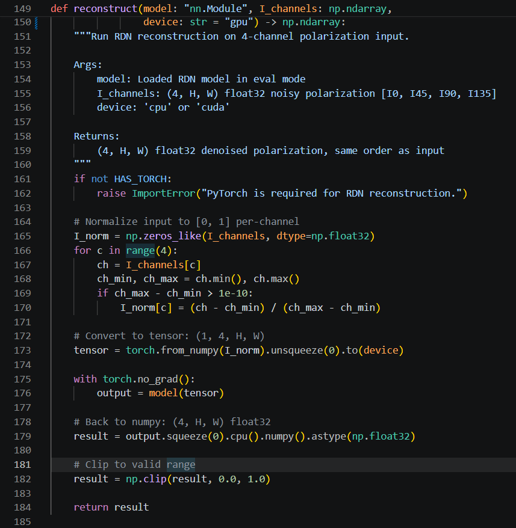

```python
def reconstruct(model, I_channels, device="gpu"):
    """Run RDN reconstruction on 4-channel polarization input.
    Args:
        I_channels: (4, H, W) float32 array [I0, I45, I90, I135]
    Returns:
        (4, H, W) float32 reconstructed polarization channels
    """
```

网络权重加载（`reconstructor.py:126–128`）：

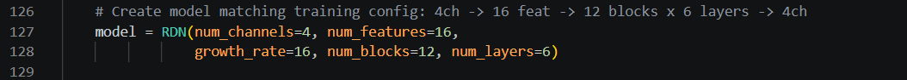

```python
model = RDN(num_channels=4, num_features=16,
            growth_rate=16, num_blocks=12, num_layers=6)
```

Stokes 参数及 AoP/DoLP 的计算代码位于 `code/algae_image_v2/core_engine/enhancement.py:19–50`：

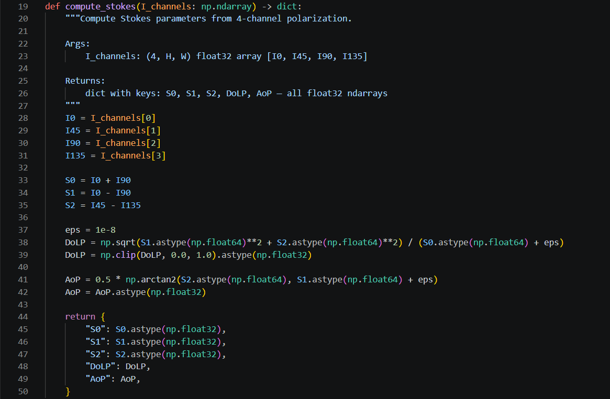

```python
def compute_stokes(I_channels):
    I0, I45, I90, I135 = I_channels[0], I_channels[1], I_channels[2], I_channels[3]
    S0 = I0 + I90                    # 总强度
    S1 = I0 - I90                    # 水平/垂直偏振差
    S2 = I45 - I135                  # 对角偏振差（需 I135！）
    DoLP = sqrt(S1² + S2²) / S0      # 线偏振度
    AoP = 0.5 * arctan2(S2, S1)     # 偏振角
```

---

## 二、有监督训练：含噪输入 → 无噪真值

### 2.1 训练数据生成

训练对生成代码位于 `code/algae_guardian/cloud_training/generate_rdn_data.py`。

训练关系为：

```
含噪偏振通道 (noise)  →  RDN  →  预测结果
                                        ↓  L1 监督
无噪偏振通道 (truth)  ──────────────────┘
```

关键代码（`generate_rdn_data.py:101–131`）：

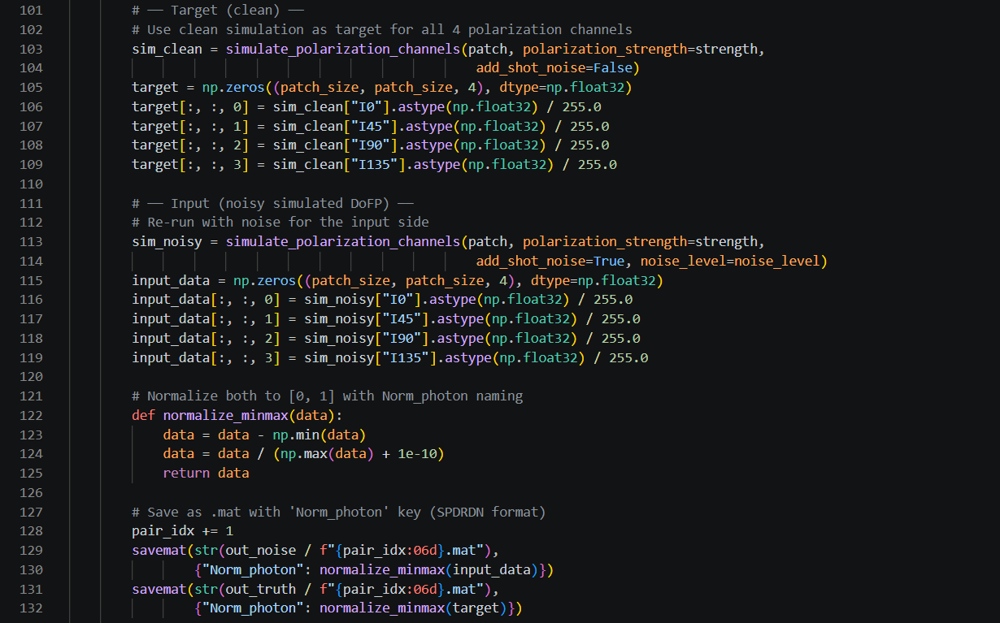

```python
# ── Target (clean) ──
# 无噪声四通道作为监督真值
sim_clean = simulate_polarization_channels(patch, polarization_strength=strength,
                                            add_shot_noise=False)
target[:,:,0] = sim_clean["I0"]   # I₀ 真值
target[:,:,1] = sim_clean["I45"]  # I₄₅ 真值
target[:,:,2] = sim_clean["I90"]  # I₉₀ 真值
target[:,:,3] = sim_clean["I135"] # I₁₃₅ 真值

# ── Input (noisy simulated DoFP) ──
# 加入传感器噪声的四通道作为网络输入
sim_noisy = simulate_polarization_channels(patch, polarization_strength=strength,
                                            add_shot_noise=True, noise_level=noise_level)
input_data[:,:,0] = sim_noisy["I0"]
# ... (四通道同理)

# 分别保存 noise/ 和 truth/ 目录
savemat(out_noise / f"{pair_idx:06d}.mat", {"Norm_photon": input_data})
savemat(out_truth / f"{pair_idx:06d}.mat", {"Norm_photon": target})
```

每对训练数据由同一图像 patch 生成：

- **真值（truth）**：结构张量 + Malus 定律模拟的纯净四通道偏振图像；
- **输入（noise）**：同一物理过程但叠加了 shot noise 的含噪版本。

### 2.2 训练循环

训练循环位于 `code/RDN_HSV_0526/train.py:123–137`：

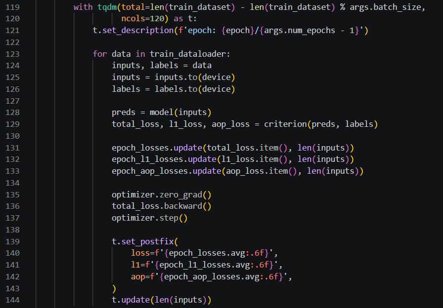

```python
for data in train_dataloader:
    inputs, labels = data
    inputs = inputs.to(device)
    labels = labels.to(device)
    preds = model(inputs)                        # RDN 前向推理
    total_loss, l1_loss, aop_loss = criterion(preds, labels)
    optimizer.zero_grad()
    total_loss.backward()
    optimizer.step()
```

> **注意**：`RDN_HSV_0526` 目录为 HSV 偏振实验分支（PSNR ≈ 22.03 dB），其训练框架代码可作为附录参考，但性能数据不应与结构张量主线（PSNR 62.46 dB）混淆。生产版本采用的始终是结构张量管线。

---

---

## 四、物理约束二：L1 与 AoP 一致性联合损失

### 4.1 CombinedLoss 定义

损失函数位于 `code/RDN_HSV_0526/train.py:24–54`：

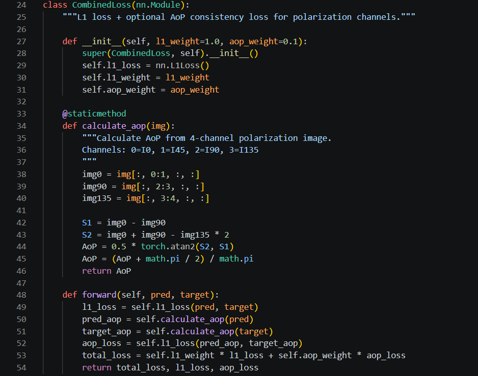

```python
class CombinedLoss(nn.Module):
    """L1 loss + AoP consistency loss for polarization channels."""
    def __init__(self, l1_weight=1.0, aop_weight=0.1):
        self.l1_loss = nn.L1Loss()
        self.l1_weight = l1_weight      # 1.0
        self.aop_weight = aop_weight    # 0.1

    @staticmethod
    def calculate_aop(img):
        """从四通道偏振图像计算 AoP。
        Channels: 0=I0, 1=I45, 2=I90, 3=I135
        """
        S1 = img[:,0] - img[:,2]              # I₀ − I₉₀
        S2 = img[:,0] + img[:,2] − img[:,3]*2 # 近似 S₂
        AoP = 0.5 * torch.atan2(S2, S1)
        return AoP

    def forward(self, pred, target):
        l1_loss = self.l1_loss(pred, target)             # 像素级 L1
        pred_aop = self.calculate_aop(pred)               # 预测 AoP
        target_aop = self.calculate_aop(target)            # 真值 AoP
        aop_loss = self.l1_loss(pred_aop, target_aop)     # AoP 一致性
        total_loss = 1.0 * l1_loss + 0.1 * aop_loss       # 联合损失
        return total_loss, l1_loss, aop_loss
```

### 4.2 损失函数的准确表述

CombinedLoss 的约束是：

> **1.0 × L1 Loss（像素级重建精度）+ 0.1 × AoP Loss（偏振角一致性）**

即同时约束：

- 每个像素的四通道强度值接近真值（L1）；
- 预测结果的偏振角（AoP）分布与真值一致（AoP consistency）。

> **⚠️ 重要纠正**：代码中**仅实现了 L1 + AoP 两项约束**，没有独立实现 DoLP Loss 或完整 Stokes（S₀/S₁/S₂）Loss。项目书请勿写成"多重损失约束"或"DoLP、Stokes 联合监督"。

### 4.3 注意

- `RDN_HSV_0526/train.py` 来自 HSV 实验分支（效果不佳的对照实验），其 CombinedLoss 实现可作为代码附录，但其 22.03 dB 的 PSNR 结果不应与结构张量主线的 62.46 dB 并列或混淆；
- 生产环境实际权重文件 `rdn_polarization.pth`（PSNR 62.46 dB @ epoch 97）来自结构张量管线训练。

---

## 五、YOLOv8s 迁移学习与数据集

### 5.1 95 类基底模型：LifeWatch FlowCam v2

训练代码：`code/algae_guardian/cloud_training/train_lifewatch_yolo_v8s.py`

迁移学习策略（`train_lifewatch_yolo_v8s.py:42–52`）：

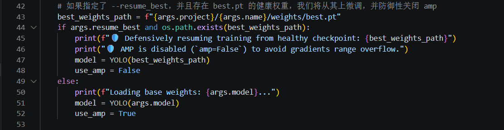

```python
# 加载 COCO 预训练权重 → 全网络微调
model = YOLO("yolov8s.pt")      # 第 16 行默认参数
# 或从已有最佳权重防御性恢复
model = YOLO(best_weights_path)  # 第 47 行
```

训练配置（`train_lifewatch_yolo_v8s.py:55–78`）：

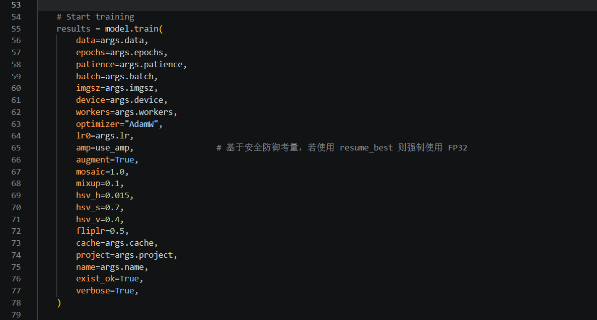

```python
results = model.train(
    data=args.data,         # LifeWatch 95 类 YOLO 格式
    epochs=100,
    imgsz=320,              # 适配低分辨率 FlowCam 颗粒
    batch=128,
    optimizer="AdamW",
    lr0=0.0002,
    augment=True,
    mosaic=1.0, mixup=0.1,
    hsv_h=0.015, hsv_s=0.7, hsv_v=0.4,
    fliplr=0.5,
)
```

> **⚠️ 重要澄清**：代码**没有设置 `freeze` 参数**，因此是"加载 COCO 预训练权重后**全网络微调**"，不是"冻结骨干网络迁移学习"。项目书请准确表述。

训练日志证据：

- `Transferred 355/355 items from pretrained weights`（`auto_train_yolo.log:44`）—— 全部 355 层权重从 COCO 预训练模型迁移；
- 95 类验证集 **mAP50 = 0.847**（`auto_train_yolo.log:82484`）。

数据来源 — **LifeWatch FlowCam v2**：

| 项目       | 说明                                |
| ---------- | ----------------------------------- |
| 名称       | LifeWatch FlowCam v2                |
| 规模       | **337,514** 张                |
|            |                                     |
| 划分       | 80% / 10% / 10%（train/val/test）   |
| 采集设备   | FlowCam VS-4，4× 放大              |
| 来源       | 比利时北海 LifeWatch 监测计划       |
| DOI        | `10.5281/zenodo.16679297`         |
| 原始发布页 | https://zenodo.org/records/16679297 |

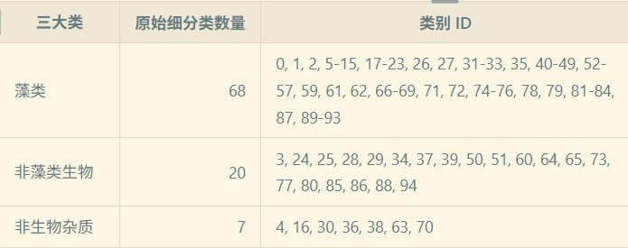

### 5.2 当前五类演示模型：FMPD

当前运行版 `algae_image_v2` 实际使用 **FMPD 五分类模型**（非 95 类 LifeWatch 模型），配置见 `code/algae_image_v2/core_engine/config.py:11–18`：

```python
FMPD_5_CLASSES = {
    0: "Other-phytoplankton",
    1: "Non-phytoplankton",
    2: "Woronichinia",
    3: "Spiroides",
    4: "Dinobryon",
}
```

对应训练代码 `code/algae_guardian/cloud_training/train_yolo_v8s.py`（同样为全网络微调，无冻结）。

数据来源 — **FMPD（Freshwater Microscopy Phytoplankton Dataset）**：

| 项目       | 说明                                                          |
| ---------- | ------------------------------------------------------------- |
| 名称       | Freshwater Microscopy Phytoplankton Dataset (FMPD)            |
| 规模       | 293 张多目标显微图像                                          |
| 类别       | 5 类                                                          |
| 图像尺寸   | 2080 × 1540 px，TIFF 格式                                    |
| 标注格式   | COCO bounding boxes                                           |
| 采集设备   | Nikon Eclipse E600，10× 明场显微镜 + AxioCam ICc5 Zeiss 相机 |
| 采样地点   | Lake of Doniños, Ferrol, Galicia, Spain                      |
| DOI        | `10.5281/zenodo.11126643`                                   |
| 原始发布页 | https://zenodo.org/records/11126643                           |

> **⚠️ 重要纠正**：FMPD **不是** FlowCam 数据（FlowCam 是 Fluid Imaging Technologies 的成像流式细胞仪）。FMPD 使用 Nikon Eclipse E600 正置显微镜 + AxioCam ICc5 彩色相机，10× 物镜，固定照明和焦点拍摄。项目文书中的设备描述请据此修正。

FMPD 许可限制（`readme.txt`）：

- 仅限**非商业学术或研究用途**；
- 需引用指定论文（Figueroa et al., 2023; Rivas-Villar et al., 2021）；
- **禁止重新分发**完整数据集、实质部分或衍生物；
- 附录应列明来源和论文引用，**不要打包原始数据**。

### 5.3 两个模型的明确区分

| 维度      | 95 类竞赛模型                   | 当前五类演示模型              |
| --------- | ------------------------------- | ----------------------------- |
| 数据集    | LifeWatch FlowCam v2            | FMPD                          |
| 规模      | 337,514 张                      | 293 张                        |
| 类别数    | 95                              | 5                             |
| YOLO 架构 | YOLOv8s                         | YOLOv8s                       |
| mAP50     | 84.7%（结构张量增强）           | 73.9%（train=val 评估）       |
| 训练代码  | `train_lifewatch_yolo_v8s.py` | `train_yolo_v8s.py`         |
| 用途      | 竞赛/论文指标展示               | 当前产品演示                  |
| 预训练    | COCO yolov8s.pt → 全网络微调   | COCO yolov8s.pt → 全网络微调 |

> **⚠️ 注意**：不要从 `deploy_v8l.py` 截代码——它并非项目书所述的 YOLOv8s 主线，且包含不适合公开的部署信息。
